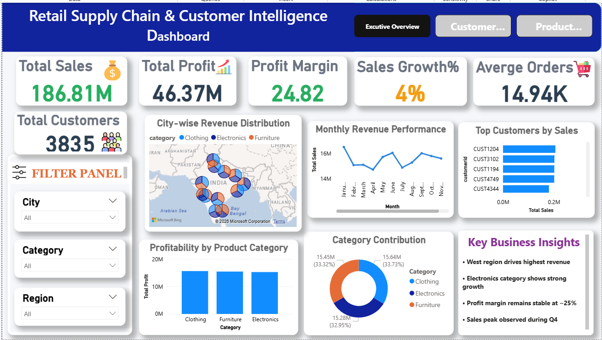
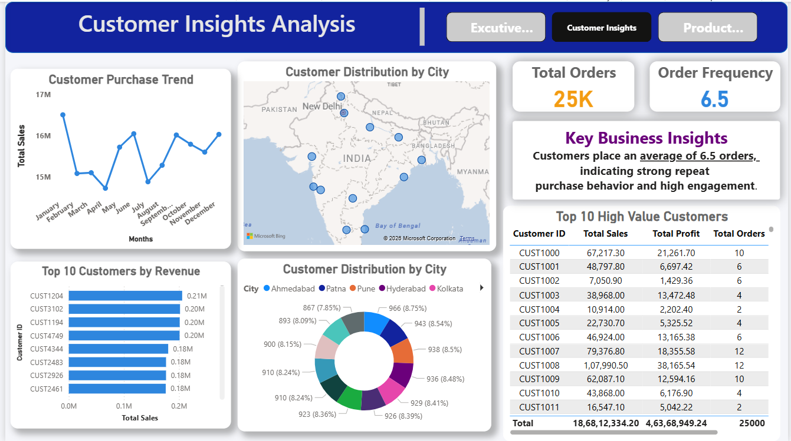
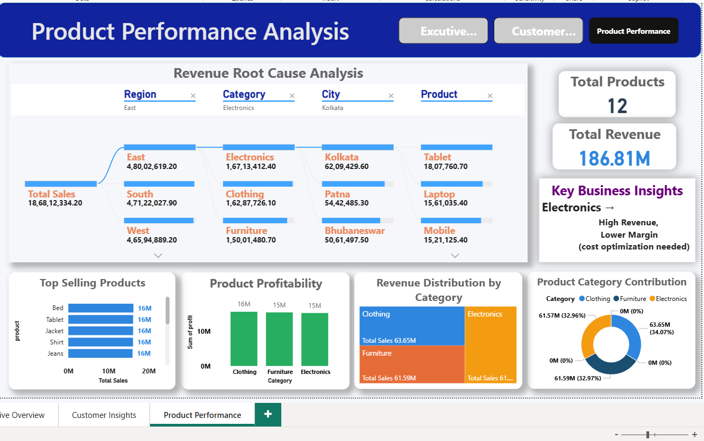

# 🚀 Retail Supply Chain & Customer Intelligence Dashboard

## 📊 Project Overview
This project presents an end-to-end data analytics solution for a retail business, focusing on sales performance, customer behavior, and product insights. The objective is to transform raw data into meaningful business insights using modern data tools.z

## 🛠️ Tech Stack
- 🐍 Python → Data generation  
- 🗄️ SQL → Data querying & analysis  
- 📊 Power BI → Interactive dashboard & visualization  
- 📑 Excel → Data cleaning & preprocessing  

## 📁 Project Structure

python/ → Data generation scripts
dataset/ → Cleaned dataset
sQL/ → SQL queries used for analysis
powerBI/ → Power BI dashboard (.pbix)
screenshots/ → Dashboard previews

## 📌 Key Features
- ✔ Sales & Profit Analysis  
- ✔ Customer Insights & Behavior Tracking  
- ✔ Product Performance Analysis  
- ✔ Region-wise & Category-wise breakdown  
- ✔ Interactive filters & drill-down  

## 📈 Key Business Insights
- 📌 Average order frequency (~6.5) indicates strong customer engagement  
- 📌 High-value customers contribute significantly to total revenue  
- 📌 Certain product categories generate high revenue but lower profit margins  
- 📌 Sales trends remain stable with peak performance in specific months  

## 🎯 Business Impact
This dashboard enables data-driven decision-making by identifying:
- Growth opportunities  
- High-value customer segments  
- Product-level profitability  
- Regional performance trends  

## 📷 Dashboard Preview

## 💡 Conclusion
This project demonstrates practical implementation of data analytics concepts including data cleaning, modeling, and visualization, making it suitable for real-world business scenarios.

## ✨ About This Project
This project was built as part of my learning journey in Data Analytics to apply real-world business problem solving using Power BI, SQL, and Python.

